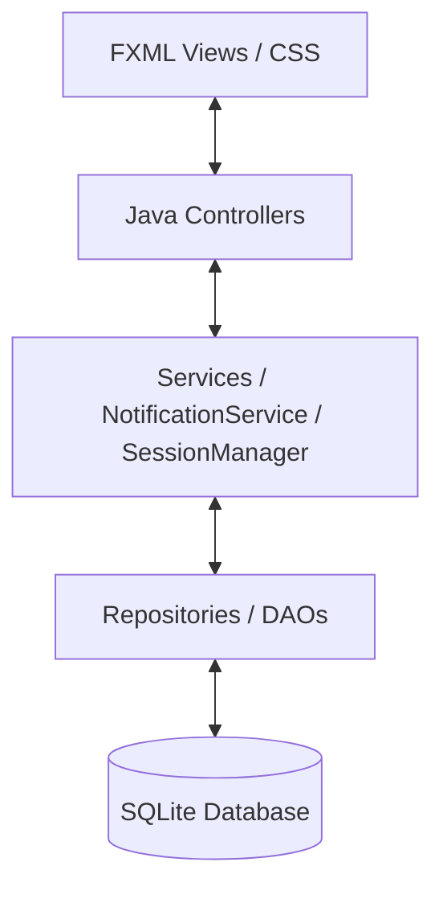

# System Architecture & Directory Structure

This document outlines the high-level system structure, the Model-View-Controller (MVC) layers, and file responsibility boundaries.

## 1. Architectural Model

The application is structured around a decoupled Model-View-Controller (MVC) architecture, where visual nodes and database transactions communicate strictly through dedicated business services.



### Components and Separation of Concerns (SoC)

*   **View Layer (FXML / CSS)**: Defines the user interface declaratively. No business logic, persistence interactions, or manual inline style values are permitted in this layer.
*   **Controller Layer (Java Controllers)**: Captures user interaction events and updates view nodes. It relies on standard repositories to read/write state and invokes system services for shared application flows.
*   **Service Layer (Services)**: Houses state machines, background asynchronous listeners, session caches, and global event triggers (e.g., active user sessions, notification dispatchers).
*   **Repository Layer (DAOs)**: Performs low-level CRUD data transactions against the local persistence unit via structured query operations, inheriting common features from `BaseRepository`.
*   **Database (SQLite)**: Persists local tables.

---

## 2. Directory Layout & Package Map

```text
eggspress/
│
├── config/                         # Infrastructure property files
│   └── database.properties         # Database path and connection properties
│
├── src/
│   └── main/
│       ├── java/
│       │   └── cpe223/
│       │       └── group8/
│       │           └── eggspress/
│       │               ├── Main.java    # Application graphics bootstrapper
│       │               │
│       │               ├── config/      # Driver bindings and database migrations
│       │               │   └── DatabaseConfig.java
│       │               │
│       │               ├── models/      # Domain entity logic structures
│       │               │   ├── User.java
│       │               │   ├── ChickenHouse.java
│       │               │   └── Notification.java
│       │               │
│       │               ├── repository/  # Data Access CRUD layers
│       │               │   ├── BaseRepository.java
│       │               │   └── NotificationRepository.java
│       │               │
│       │               ├── services/    # Session caches and sync layers
│       │               │   ├── SessionManager.java
│       │               │   └── NotificationService.java
│       │               │
│       │               └── controllers/ # Glue layer between views and data models
│       │                   ├── DashboardController.java
│       │                   └── InventoryController.java
│       │
│       └── resources/               # View declarations and static skins
│           ├── cpe223/
│           │   └── group8/
│           │       └── eggspress/
│           │           ├── views/       # Layout files
│           │           ├── css/         # View skins and active themes
│           │           └── icons/       # Action and indicator graphics
```
