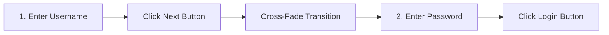

# User Session & Authentication Reference

This document explains user authentication logic, database schema access, active session state caching, new profile isolation, and multi-step login interface transitions.

## 1. Domain Entities & Memory Session

Authentication properties are encapsulated within the system layers:

### A. User Entity (`User.java`)
*   `username` (`String`): Identifier key.
*   `password` (`String`): Plaintext credential string.

### B. Session Caching (`SessionManager.java`)
Active credentials are held in a global session memory:
*   **Static Tracker**: Exposes `currentUser` as an active instance.
*   **Login / Logout Helpers**: `SessionManager.login(User user)` sets the current context, and `SessionManager.logout()` flushes the cache back to `null`.
*   **Active Identifiers**: `SessionManager.getCurrentUsername()` returns the active username string, defaulting to `admin` if no user session is populated.

---

## 2. Dynamic Multi-Step Login Interface

The login view implements a split step transition sequence inside `LoginController.java` to prevent cluttering the interface:



### Transition Mechanics
1.  **Step 1: Username Check**: The user inputs a username. If empty, the field style toggles to `text-input-error`.
2.  **Cross-Fade Animation Sequence**: 
    *   A `FadeTransition` fades out the username container and its buttons (`1.0` to `0.0` opacity over exactly `150ms`).
    *   On animation finish, the username nodes are hidden (`setVisible(false)` and `setManaged(false)`).
    *   The password nodes are activated (`setVisible(true)` and `setManaged(true)`) and cross-fade in (`0.0` to `1.0` opacity over `150ms`).
    *   Input focus shifts directly to the password input box via `passwordField.requestFocus()`.

---

## 3. Database Credentials Auditing

Validations utilize queries targeting the local database tables via `UserRepository.java`:

### A. Standard Sign-In Validation
```java
// Iterate and verify credentials against stored records
boolean isAuthenticated = false;
for (User user : UserRepository.getStaticUsers()) {
    if (user.getUsername().equals(username) && user.getPassword().equals(password)) {
        isAuthenticated = true;
        break;
    }
}
```

### B. Transaction-Safe Registration & Alert Isolation
When creating a new profile, the database execution is wrapped in a unified transaction to guarantee data integrity across related tables. This process prevents historical global notifications from populating the new user's notification drawer:

```sql
-- Step A: Insert the new user account record
INSERT INTO users (username, password) VALUES (?, ?);

-- Step B: Prefill tracking table mapping all historical alert IDs as read/cleared for the new user
INSERT INTO user_notification_states (username, notification_id, is_read, is_cleared)
SELECT ?, id, 1, 1 FROM notifications;
```

If any SQL query fails, the connection calls a transaction rollback (`conn.rollback()`) to ensure no partial records are committed.
