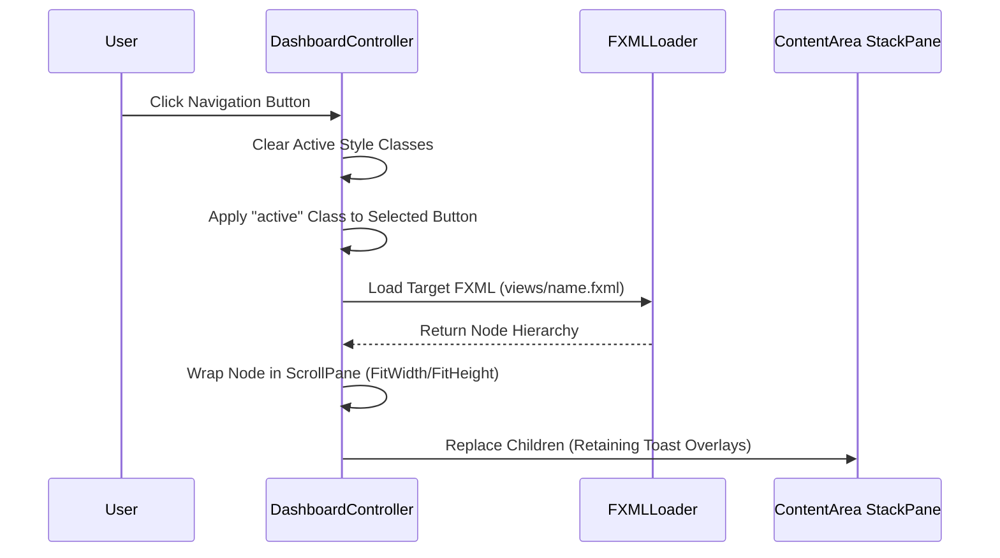

# View Routing & Window Navigation

This document explains the JavaFX bootstrapping process, navigation architecture, dynamic FXML view-swapping models, collapsible sidebar mechanics, and detached scene popup operations.

## 1. Application Bootstrapping

The system entry point is located in `Main.java`, which boots the graphics runtime and sets the initial parent scene node container:

```java
public class Main extends Application {
    @Override
    public void start(Stage stage) throws IOException {
        // Initializes stage window and sets the default view to login.fxml
        Scene scene = new Scene(loadFXML("views/login"), 800, 600);
        stage.setScene(scene);
        stage.show();
    }
}
```

---

## 2. Main Shell Layout Chrome

The main layout is defined in `dashboard.fxml` and controlled by `DashboardController.java`. The shell consists of:
*   **SplitPane**: Divides the layout into a left sidebar and a right content area.
*   **Sidebar Panel (`sidebar`)**: Contains navigation buttons and the collapsing action container.
*   **Content Area (`contentArea`)**: A flat `StackPane` which holds the active sub-view and floating toast notifications.

---

## 3. Navigation & Dynamic FXML Loading

Sub-views are dynamically loaded and injected into the active UI space via the `loadView(String fxmlName)` method in `DashboardController.java`:



### Wrapping Sub-Views
To guarantee scrollability and responsiveness across differing aspect ratios, loaded sub-views are wrapped in a ScrollPane before insertion:
```java
ScrollPane scrollPane = new ScrollPane(view);
scrollPane.setFitToWidth(true);
scrollPane.setFitToHeight(true);
scrollPane.setStyle("-fx-background-color: transparent; -fx-background: transparent; -fx-border-color: transparent;");
```

---

## 4. Collapsible Sidebar Mechanism

The left sidebar can collapse flush against the edge to maximize the active content pane space:

1.  **Collapse Trigger (`handleToggleSidebar()`)**:
    *   Saves the previous divider position ratio (default: `0.125`).
    *   Hides `sidebarContent` entirely and marks it unmanaged (`setManaged(false)`).
    *   Snaps the sidebar constraints and divider position to `0.0`.
2.  **Expand Trigger**:
    *   Restores the sidebar min/max width constraints (`260px` to `400px`).
    *   Restores the saved divider position ratio.
    *   Makes `sidebarContent` visible and managed.

---

## 5. Floating Popup Scene Management

The notification drawer acts as a detached popover. Because popups exist outside the main window's scene graph, they do not inherit stylesheets automatically.

### Stylesheet Injection
To prevent unstyled components, the global and theme stylesheet stacks must be programmatically injected into the popup scene on creation:

```java
String[] cssResources = {
    "css/global.css",
    "css/light.css",
    "css/dashboard/dashboard.css",
    "css/dashboard/light.css"
};
for (String resource : cssResources) {
    URL url = Main.class.getResource(resource);
    if (url != null) {
        popupContent.getStylesheets().add(url.toExternalForm());
    }
}
```

### Drag Resizing Gesture Engine
The notification panel supports manual resizing. Resizing drag events (`SW`, `SE`, `S`, `E`, `W`) intercept stage cursor behaviors and update pref dimensions under strict boundaries:
*   **Width Boundaries**: Constrained between `360px` and `800px`.
*   **Height Boundaries**: Constrained between `450px` and `900px`.

---

## 6. Asynchronous Thread-Safe UI Updates

Incoming network notifications or database poller results occur outside the JavaFX application thread. Interacting with the UI from these threads will throw runtime errors.

All active drawer refreshments and toast generations must be wrapped inside the graphics thread queue:
```java
Platform.runLater(() -> {
    updateUnreadBadgeCount();
    showPushToast(notification);
});
```
