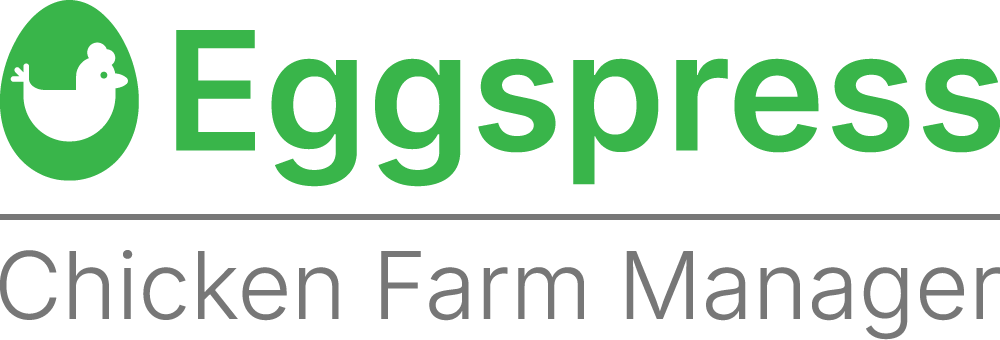

# Eggspress Chicken Farm Manager



> [!WARNING]
> This repository is created for educational use only.

Welcome to Eggspress Chicken Farm Manager. For coding simplicity in packages, directories, and Maven configuration, the project utilizes the identifier "eggspress". This application is a modular, high-performance farm management platform utilizing JavaFX for its interactive graphical user interface and SQLite for secure, lightweight local data persistence.

---

## System Requirements and Prerequisites

To build, run, and contribute to this repository, your local development system must meet the following software requirements:

*   **Java Development Kit (JDK)**: Version 21 (LTS release is highly recommended)
*   **Apache Maven**: Version 3.6.0 or higher
*   **Operating System**: Windows 10/11 (with PowerShell or Command Prompt)
*   **SQLite**: Local JDBC client (handled automatically via Maven dependencies)

---

## Environment Setup Instructions

We recommend using Scoop, a modern command-line installer for Windows, to easily set up and manage your development dependencies.

### 1. Installing Scoop (If not already installed)
Open PowerShell (with administrator or standard user context) and run the following commands:

```powershell
# Set script execution policy for the current user session
Set-ExecutionPolicy -ExecutionPolicy RemoteSigned -Scope CurrentUser

# Download and run the Scoop installer script
irm get.scoop.sh | iex
```

### 2. Setting up JDK and Apache Maven via Scoop
Once Scoop is installed, execute the following commands to install your Java environment and build tools:

```powershell
# Add the official Java bucket to Scoop
scoop bucket add java 

# Install OpenJDK 21
scoop install java/openjdk21 # Ignore if LTS version of Java is already installed 

# Install Apache Maven
scoop install main/maven
```

### 3. Verification
Verify your system environment paths have been successfully updated by running:

```powershell
# Verify Java installation
java -version

# Verify Maven installation
mvn -version
```

---

## How to Clone the Repository

To clone this repository and download all project files, open your terminal (PowerShell, Command Prompt, or Git Bash) and execute the following commands:

```bash
# Clone the repository
git clone https://github.com/kvedux/cpe223_eggspress.git

# Navigate into the project root directory
cd cpe223_eggspress
```

---

## Project Architecture and Directories

```text
eggspress/
│
├── config/                         # App configurations and database drivers
│   └── database.properties         # SQLite connection settings and credentials
│
├── src/
│   └── main/
│       ├── java/
│       │   └── cpe223/
│       │       └── group8/
│       │           └── eggspress/
│       │               ├── Main.java    # Application entry point (JavaFX Starter)
│       │               │
│       │               ├── config/      # Database driver connections
│       │               │   └── DatabaseConfig.java
│       │               │
│       │               ├── models/      # Domain Logic / Entity models
│       │               │   ├── User.java
│       │               │   ├── ChickenHouse.java
│       │               │   ├── FeedingSchedule.java
│       │               │   ├── InventoryItem.java
│       │               │   └── Automation.java
│       │               │
│       │               ├── repository/  # Data Access Object (DAO) CRUD interactions
│       │               │   ├── BaseRepository.java
│       │               │   ├── UserRepository.java
│       │               │   └── FarmRepository.java
│       │               │
│       │               └── controllers/ # Glue layer between views and models
│       │                   ├── LoginController.java
│       │                   ├── DashboardController.java
│       │                   ├── LayoutController.java
│       │                   ├── InventoryController.java
│       │                   ├── AcountMgmtController.java
│       │                   └── AutomationController.java
│       │
│       └── resources/               # Static markup layouts, UI styles, and brand assets
│           ├── cpe223/
│           │   └── group8/
│           │       └── eggspress/
│           │           ├── views/       # JavaFX FXML screen templates
│           │           │   ├── login.fxml
│           │           │   ├── dashboard.fxml
│           │           │   ├── layout.fxml
│           │           │   ├── inventory.fxml
│           │           │   ├── acountMgmt.fxml
│           │           │   └── automation.fxml
│           │           ├── css/         # Global stylesheets for custom skinning
│           │           │   └── styles.css
│           │           └── icons/       # Application icons
│           │               └── icon.png
│           │
│           └── kaviyes/                 # Brand and design assets
│               └── nhx/
│                   └── eggspress/
│                       ├── 1x/          # 1x PNG branding assets
│                       │   ├── Eggspress-App-Icon.png
│                       │   ├── Eggspress-Combination-Mark-Full.png
│                       │   ├── Eggspress-Combination-Mark.png
│                       │   ├── Eggspress-Icon.png
│                       │   └── Wordmark.png
│                       ├── SVG/         # SVG Vector branding assets
│                       │   ├── Eggspress App Icon.svg
│                       │   ├── Eggspress Combination Mark Full.svg
│                       │   ├── Eggspress Combination Mark.svg
│                       │   ├── Eggspress Icon.svg
│                       │   └── Wordmark.svg
│                       └── ...          # Additional scaled assets (0.2x, 0.5x, etc.)
│
├── database/                        # Dedicated directory for database files
│   └── eggspress.db
│
├── .gitignore                       # Standard version-control filter definitions
└── pom.xml                          # Maven build descriptors and core dependencies
```

---

## Execution and Compilation

Follow these quick commands to build and test Eggspress Chicken Farm Manager:

### 1. Build and Compile
Fetches JavaFX and SQLite modules, resolves all libraries, and compiles the source code:
```bash
mvn clean compile
```

### 2. Run Application
Launches the JavaFX graphics UI environment:
```bash
mvn clean javafx:run
```

---

## Collaborative Workflow (Creating a Pull Request)

To submit your code changes to the project without sending manual files back and forth, follow the official Git branching and Pull Request (PR) workflow:

### Step 1: Pull the Latest Changes
Always start by retrieving the latest updates from the main branch on GitHub before writing new code:
```bash
# Switch to the main branch
git checkout main

# Retrieve and merge the latest code
git pull origin main
```

### Step 2: Create a Feature Branch
Create a new branch dedicated to your task. Replace "your-feature-name" with a descriptive task identifier (for example, "feature/login-validation"):
```bash
git checkout -b feature/your-feature-name
```

### Step 3: Code and Commit Changes
Edit your files and save your progress locally. Stage and commit your changes using a professional description:
```bash
# Check which files were modified
git status

# Stage all changes for commit
git add .

# Save the changes with a clear summary
git commit -m "Implement validation checks on the login screen"
```

### Step 4: Push to GitHub
Upload your local branch and commits directly to the remote GitHub server:
```bash
git push origin feature/your-feature-name
```

### Step 5: Submit a Pull Request
1. Open your web browser and navigate to: `https://github.com/kvedux/cpe223_eggspress`
2. You will see a yellow banner stating your branch was recently pushed, click **Compare & pull request** (or click the **Pull requests** tab, followed by **New pull request**).
3. Review your changes, input a descriptive title and outline what was done in the comment section.
4. Click **Create pull request**.
5. Once your team members review and approve your submission, it can be merged directly into the `main` branch.

---

## Guidelines for Collaborative Development

1. **Namespace and Package Consistency**: Always keep the "package cpe223.group8.eggspress;" namespace in all new Java files.
2. **Database Management**: Connection logic is centralized inside DatabaseConfig.java. Do not write raw JDBC connection strings inside your views or controllers.
3. **JavaFX Integration**: Assign FXML views under views/ to their corresponding controllers under controllers/ using the "fx:controller" declaration.
